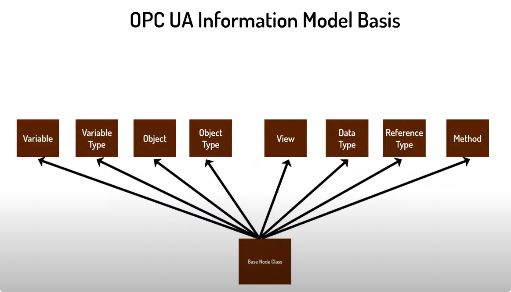
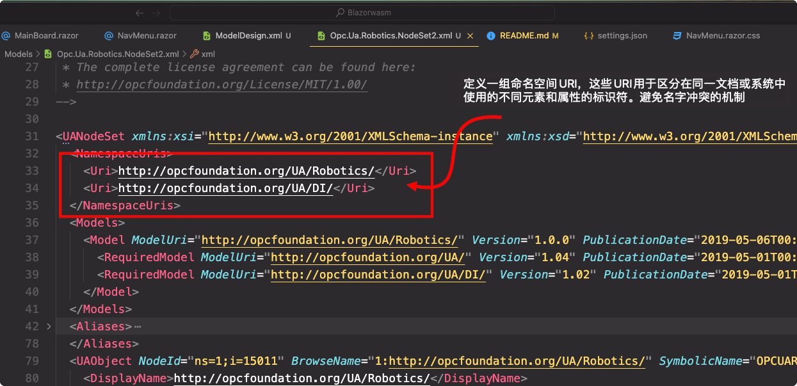
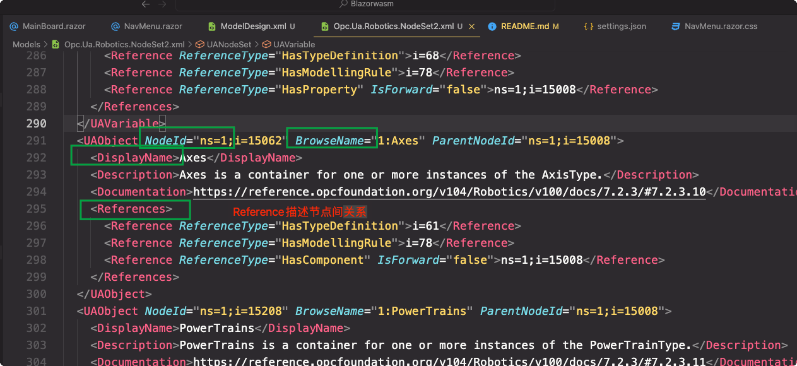
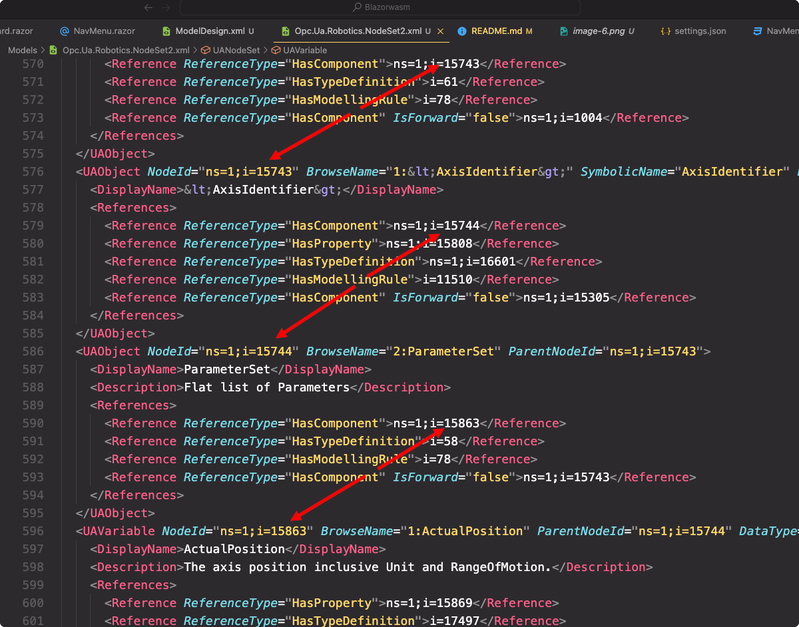
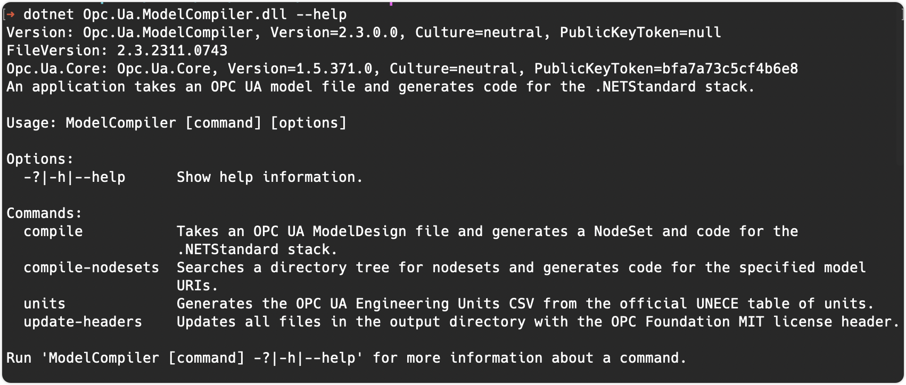
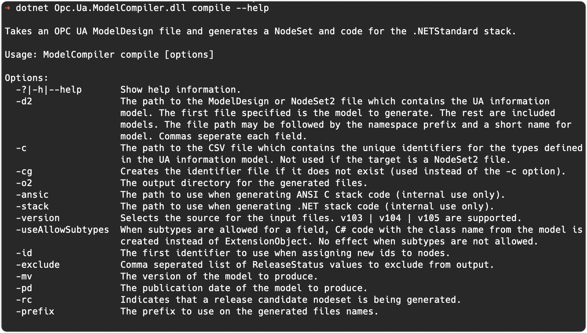

# OPC UA 前端显示和后端解析

- [OPC UA 前端显示和后端解析](#opc-ua-前端显示和后端解析)
  - [节点数据结构](#节点数据结构)
  - [XML 文件生成过程](#xml-文件生成过程)
  - [主流现成 Server api 和 SDK](#主流现成-server-api-和-sdk)

前端某一些数据来自于 开放平台通信统一架构（OPC UA）

> OPC UA（Open Platform Communications Unified Architecture）是一种跨平台的工业通讯协议标准，它由 OPC Foundation 制定。OPC UA 的目标是为工业自动化领域提供一个可互操作、可扩展和安全的通讯协议。

## 节点数据结构

标准格式数据对象存储在 `NodeSet2.xml` 格式的文件中，对象类型定义了一组通用属性、方法和对象的事件。对象类型充当了创建具有相同特性的对象实例的模板。该模板被称为“根节点类”，具有以下一些特征。

```
必要特征
1. Node Id
2. Display Name
3. Node Class
4. Browse Name

可选特征
1. Description
```

基于根节点派生出这八种节点类型，可以根据需要组合它们以呈现不同结构的微电网。


自定义信息模型可以基于 OPC UA 基本信息模型构建。使用文本编辑器（选择 `VScode`）和图形工具（选择 [UaModeler for mac](https://www.unified-automation.com/products/development-tools/uamodeler.html?gclid=Cj0KCQiAgK2qBhCHARIsAGACuzl8RDtvynZhJ681uAPUuVPAIr1SLwtvwHlIyUFPaqKCluQelkwgPSsaAqoMEALw_wcB)）来创建 `ModelDesign.xml` 文件。

具体 XML 文件内容示例:




## XML 文件生成过程

生成 `NodeSet.xml` 文件的步骤如下:
可参考 [视频教程](https://www.youtube.com/watch?v=gxA7SDNLHgc)

1. 编写 `ModelDesign.xml`

2. 使用 [UA-ModelCompiler](https://github.com/OPCFoundation/UA-ModelCompiler) 辅助将`ModelDesign.xml` 生成 `NodeSet2.xml` 这一步 git clone 之后 release 模式运行 solution `.sin`, win 环境会生成 `Opc.Ua.ModelCompiler.exe` 可执行文件

   ```bash
   # 运行命令如下
   .\Opc.Ua.ModelCompiler.exe -d2 <filepath.xml> -cg <filepath.csv> -o <output_directorypath>
   # eg.
   .\opc.Ua.Modelcompiler.exe -d2 C:\Models \ModelDesign.xml -cg C:\Models\ModelDesign.csv -o  C:\Models
   ```

   mac 环境会生成`.dll` 文件，用 `dotnet` 运行

   ```bash
     # 运行命令如下
     dotnet Opc.Ua.ModelCompiler.dll compile -d2 <filepath.xml> -cg <filepath.csv> -o2 <output_directorypath>
     # eg.
     dotnet Opc.Ua.ModelCompiler.dll compile -d2 /Users/zhangyuanpu/Documents/CSharp/Blazorwasm/Models/ModelDesign.xml -cg /Users/zhangyuanpu/Documents/CSharp/Blazorwasm/Models/ModelDesign.csv -o2 /Users/zhangyuanpu/Documents/CSharp/Blazorwasm/Models/
   ```

   可以用这种方式得到命令参数：

   
   

3. 由此，`NodeSet2.xml` 文件会被生成，同时也会生成 `.cs` 文件和配置文件，由此可以搭建 `OPCUA server`

## 主流现成 Server api 和 SDK

以下提供了服务器端的 API：

> 1. **Open62541** - 这是一个开源的 C 语言库，它实现了 OPC UA 通信协议，并提供了创建 OPC UA 服务器和客户端的 API。

> 2. **NodeOPCUA** - 这是一个开源的 Node.js 库，允许在 Node.js 环境中创建 OPC UA 服务器和客户端。

> 3. **FreeOpcUa** - 这是一个开源的 Python 库，提供了创建 OPC UA 服务器和客户端的接口。

> 4. **OPC Foundation's .NET Standard Library** - OPC 基金会提供了一个.NET 标准库，可以在.NET 环境中使用，支持创建 OPC UA 服务器和客户端。

> 5. **Unified Automation 的高性能 SDK** - Unified Automation 提供了用于 C++, C#和 Java 的高性能 SDK，可以用来开发 OPC UA 服务器和客户端。

> 使用这些库创建的 OPC UA 服务器通常会实现标准的 OPC UA 服务集，包括但不限于：

> > - **Session Services** - 创建和管理与客户端的会话。
> > - **Attribute Services** - 读写节点的属性。
> > - **View Services** - 浏览地址空间。
> > - **Method Services** - 调用方法。
> > - Monitored Items and Subscription Services\*\* - 监控数据变化和事件订阅。
