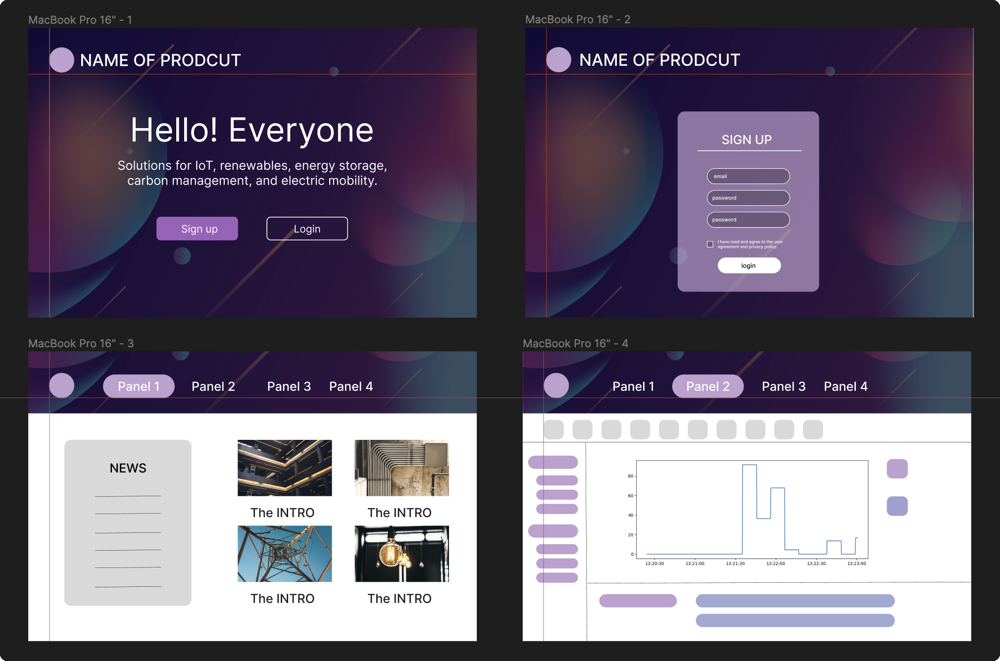
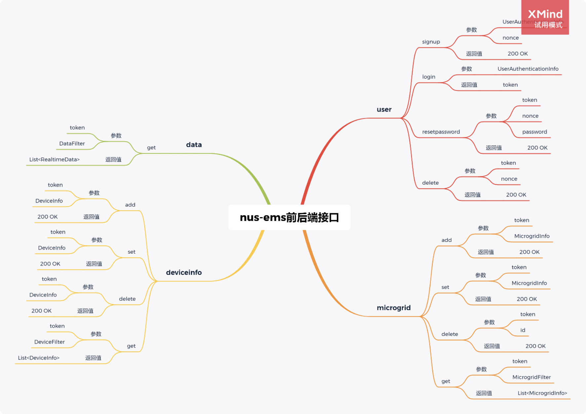
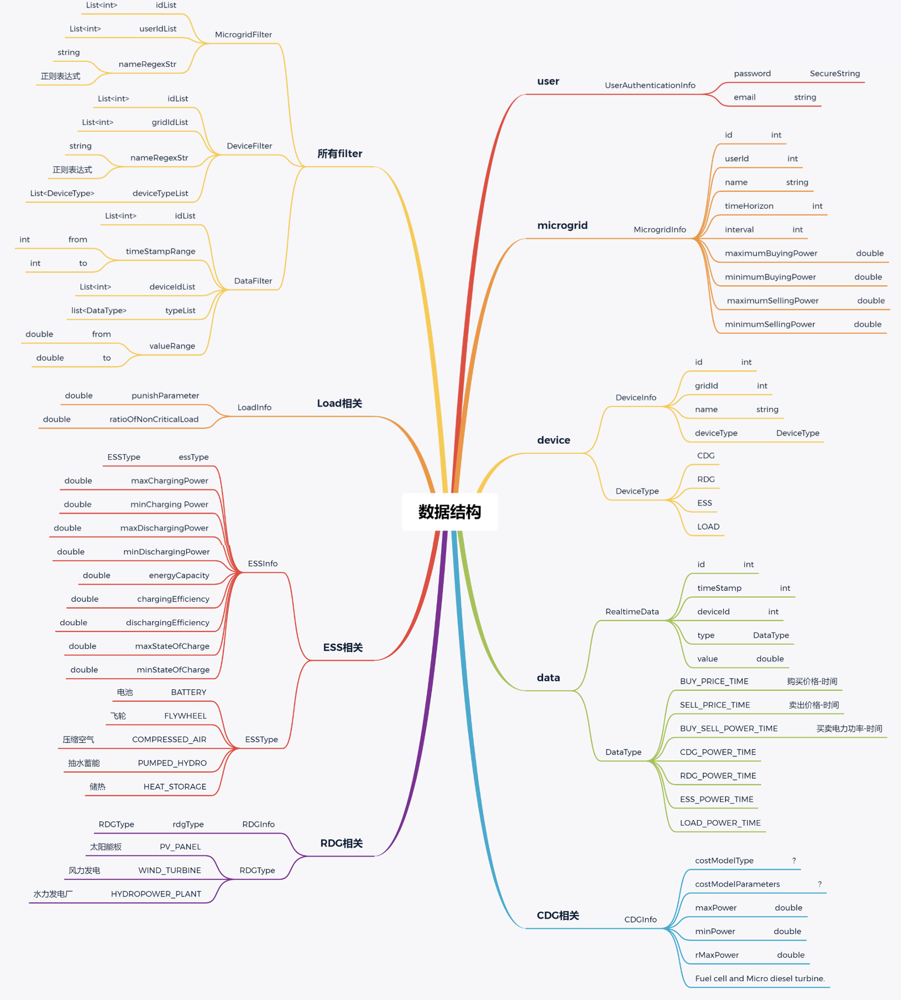

  
  <h1>MicrogirdSync</h1>

  
Energy management of microgrids

   

你可以在这两种语言中选择其一来阅读 `readme` 文档:

- [中文](/README.md)
- [English](./README_en.md)

我们的项目是为微电网的能源管理构建基于 web 的 GUI 软件开发。

- [UI 设计](#ui-设计)
- [前端相关](#前端相关)
  - [前端接口设计图](#前端接口设计图)
  - [前端实现](#前端实现)
    - [获取 opcua 数据](#获取-opcua-数据)
- [后端相关](#后端相关)
  - [关键词定义](#关键词定义)
  - [项目功能需求列表](#项目功能需求列表)
  - [后端功能接口设计](#后端功能接口设计)

## UI 设计

使用 `figma` 作为用户界面，标志，特殊元素的设计工具。只是画出一些页面块的参考。在实际的前端编写过程中使用了各种组件库，如 [bootstrap](https://getbootstrap.com/docs/5.3/getting-started/introduction/)
, [tailwindcss](https://tailwindcss.com/docs/installation), [antv-G2](https://g2.antv.antgroup.com/) 等。

## 前端相关

使用 `CSharp` 以及 `Blazor WebAssembly` 模板来完成项目前端逻辑

### 前端接口设计图

### 前端实现

#### 获取 opcua 数据

[opcua server 数据](./Docs/opcua.md)

opcua client 数据

## 后端相关

### 关键词定义

| 序号 | 名词      | 解释                     |
| ---- | --------- | ------------------------ |
| 1    | MicroGrid | 微型电力网络             |
| 2    | CDG       | 可控分布式发电机         |
| 3    | RDG       | 非可控可再生分布式发电机 |
| 4    | ESS       | 储能系统                 |
| 5    | SOC       | 储能系统（ESS）的储电量  |

### 项目功能需求列表

| 序号 | 模块                 | 功能                            | 功能规则                                                                                                                                                                                                                                                                                                                                                              |
| ---- | -------------------- | ------------------------------- | --------------------------------------------------------------------------------------------------------------------------------------------------------------------------------------------------------------------------------------------------------------------------------------------------------------------------------------------------------------------- |
| 1    | 用户验证界面         | 用户注册                        | 用户注册时需要输入以下信息 1. 密码 2. 电子邮箱地址 用户的密码需要满足以下条件： 1. 长度为 6-20 位 2. 包含数字与字母                                                                                                                                                                                                                          |
| 2    |                      | 用户登录                        | 用户输入电子邮箱地址与密码，执行登录指令。                                                                                                                                                                                                                                                                                                                            |
| 3    |                      | 用户找回密码                    | 用户发出找回密码指令，系统发送验证码至用户电子邮件地址，由用户输入。如果核验成功，用户输入并确认新密码，否则退出流程。                                                                                                                                                                                                                                                |
| 4    | 微电网管理界面       | 用户添加 MicroGrid              | 用户添加 MicroGrid 时，需要输入如下属性： 1. MicroGrid 名称 2. Time Horizon 3. Interval 4.maximum buying power 5. minimum buying power 6. maximum selling power 7. minimum selling power                                                                                                                                           |
| 5    |                      | 用户删除 MicroGrid              | 用户删除没有任何组件的 MicroGrid 时，不提示，直接删除 否则，询问用户是否删除非空 MicroGrid，确认后删除                                                                                                                                                                                                                                                           |
| 6    |                      | 用户修改 MicroGrid 属性         |                                                                                                                                                                                                                                                                                                                                                                       |
| 7    |                      | 用户 MicroGrid 中添加 CDG       | 用户添加 CDG 时需输入如下属性： 1. CDG 名称 2. CDG 的 OPCUA 地址 3. cost model type 4. cost model parameters 5. Max Power(kW) 6. MinPower(kW) 7. R_Max Power(kW)                                                                                                                                                                   |
| 8    |                      | 用户 MicroGrid 中删除 CDG       | 用户删除时，询问用户，确认后删除                                                                                                                                                                                                                                                                                                                                      |
| 9    |                      | 用户修改 MicroGrid 中 CDG 属性  |                                                                                                                                                                                                                                                                                                                                                                       |
| 10   |                      | 用户 MicroGrid 中添加 RDG       | 用户添加 RDG 时，需要输入如下属性： 1. RDG 名称 2. RDG 种类                                                                                                                                                                                                                                                                                                 |
| 11   |                      | 用户 MicroGrid 中删除 RDG       | 用户删除时，询问用户，确认后删除                                                                                                                                                                                                                                                                                                                                      |
| 12   |                      | 用户修改 MicroGrid 中 RDG 属性  |                                                                                                                                                                                                                                                                                                                                                                       |
| 13   |                      | 用户 MicroGrid 中添加 ESS       | 用户添加 ESS 时，需要输入以下属性： 1. ESS 名称 2. ESS 种类 3. Max Charging Power(kW) 4. Min Charging Power(kW) 5. Max Discharging Power(kW) 6. Min Discharging Power(kW) 7. Energy Capacity(kWh) 8. Charging Efficiency(%) 9. Discharging Efficiency(%) 10. Max State of Charge(%) 11. Min State of Charge(%) |
| 14   |                      | 用户 MicroGrid 中删除 ESS       | 用户删除时，询问用户，确认后删除                                                                                                                                                                                                                                                                                                                                      |
| 15   |                      | 用户修改 MicroGrid 中 ESS 属性  |                                                                                                                                                                                                                                                                                                                                                                       |
| 16   |                      | 用户 MicroGrid 中添加 Load      | 用户添加 load 时需要输入以下属性： 1. Load 名称 2. Punish Parameter 3. Ratio of Non-critical Load(%)                                                                                                                                                                                                                                                   |
| 17   |                      | 用户 MicroGrid 中删除 Load      | 用户删除时，询问用户，确认后删除                                                                                                                                                                                                                                                                                                                                      |
| 18   |                      | 用户修改 MicroGrid 中 Load 属性 |                                                                                                                                                                                                                                                                                                                                                                       |
| 19   | 微电网可视化观察界面 | 电力价格图像绘制                | 网页绘制电力购买价格、电力出售价格的价格-时间图像                                                                                                                                                                                                                                                                                                                     |
| 20   |                      | 电力买卖功率图像绘制            | 网页绘制电力买卖功率-时间图像                                                                                                                                                                                                                                                                                                                                         |
| 21   |                      | CDG 状态图像绘制                | 网页绘制 CDG 的功率-时间图像                                                                                                                                                                                                                                                                                                                                          |
| 22   |                      | RDG 状态图像绘制                | 网页绘制 RDG 的功率-时间图像                                                                                                                                                                                                                                                                                                                                          |
| 23   |                      | ESS 状态图像绘制                | 网页绘制 ESS 的充放电功率-时间图像                                                                                                                                                                                                                                                                                                                                    |
| 24   |                      | Load 状态图像绘制               | 网页绘制 Load 的功率-时间图像                                                                                                                                                                                                                                                                                                                                         |
| 25   | 用户个人资料界面     | 用户退出登录                    |                                                                                                                                                                                                                                                                                                                                                                       |
| 26   |                      | 用户修改密码                    | 用户需要完成以下流程： 1. 输入原密码 2. 输入新密码 3. 确认新密码 当且仅当原密码匹配，新密码两次输入结果一致时，系统允许修改密码行为，否则系统拒绝修改密码行为。                                                                                                                                                                                   |
| 27   |                      | 用户重置密码                    | 用户点击重置密码，弹窗询问，用户确认以后，执行功能需求 3：用户找回密码的流程。                                                                                                                                                                                                                                                                                        |
| 28   |                      | 用户修改邮箱                    | 用户点击修改邮箱，系统向原电子邮箱地址发送验证码，用户输入验证码。如果核验成功，用户输入新的电子邮箱地址并提交，系统修改用户邮箱地址。                                                                                                                                                                                                                                |
| 29   |                      | 用户删除账户                    |                                                                                                                                                                                                                                                                                                                                                                       |
| 30   | 数据服务端           | 优化电力数据                    | 数据服务端读取微电网的数据，传递给优化器，从优化器读取优化结果，将优化结果传递给微电网 【更多细节等待完善】                                                                                                                                                                                                                                                      |
| 31   |                      | 连接微电网设备                  | 数据服务端使用 OPCUA 协议，访问微电网中各个组件的 OPCUA 地址，发送指令或者读取数据 【更多细节等待完善】                                                                                                                                                                                                                                                          |

### 后端功能接口设计

[后端 API 设计文档](./Docs/api_backend.md)

