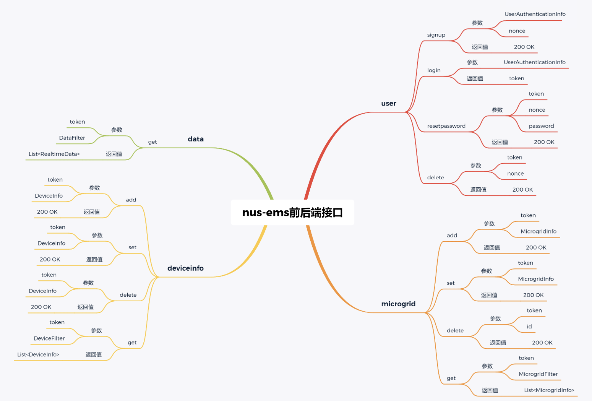

<div align="center">
  
  <h1>MicrogirdEMS</h1>
</div>

<div align="center">
  <p>Energy management of microgrids</p>
</div>

<div align="center">

[](https://docs.microsoft.com/en-us/dotnet/csharp/) [](https://dotnet.microsoft.com/download/dotnet/6.0) [](https://dotnet.microsoft.com/apps/aspnet/web-apps/blazor) [](https://www.microsoft.com/en-us/sql-server/)

</div>

你可以在这两种语言中选择其一来阅读 `readme` 文档:

- [中文](/README.md)
- [English](./README_en.md)

本项目是为微电网的能源管理构建基于 web 的 GUI 软件开发。前端开发工具`vscode`, 后端开发工具`IDEA`

- [UI 设计](#ui-设计)
- [前端相关](#前端相关)
  - [前端接口设计图](#前端接口设计图)
  - [前端预览](#前端预览)
  - [前端运行](#前端运行)
- [后端相关](#后端相关)
  - [关键词定义](#关键词定义)
  - [后端功能接口设计](#后端功能接口设计)
  - [后端实现](#后端实现)
- [opcua 数据交互](#opcua-数据交互)

## UI 设计
用 `figma` 设计UI界面, 只单纯实现基础线框图布局


## 前端相关

使用 `CSharp` 以及 `Blazor WebAssembly` 模板来完成项目前端逻辑

在实际的前端编写过程中尝试了各种组件库，如 [bootstrap V5](https://getbootstrap.com/docs/5.3/getting-started/introduction/)
, [MudBlazor](https://mudblazor.com/docs/overview)

### 前端接口设计图



### 前端预览


### 前端运行
```bash
dotnet watch run  # support hot reload
# port: 5277
```


## 后端相关

### 关键词定义

| 序号 | 名词      | 解释                     |
| ---- | --------- | ------------------------ |
| 1    | MicroGrid | 微型电力网络             |
| 2    | CDG       | 可控分布式发电机         |
| 3    | RDG       | 非可控可再生分布式发电机 |
| 4    | ESS       | 储能系统                 |
| 5    | SOC       | 储能系统（ESS）的储电量  |


### 后端功能接口设计


### 后端实现
`springboot` + `MySQL` 搭建后端测试环境，
[测试后端代码仓库](https://github.com/bloodmooncode/bwa-backend)

[API Json Colletion](./Docs/bwa-api.postman_collection.json) 可导入postman进行api接口测试

## opcua 数据交互

[opcua server 数据](./Docs/opcua.md) 未曾实现

