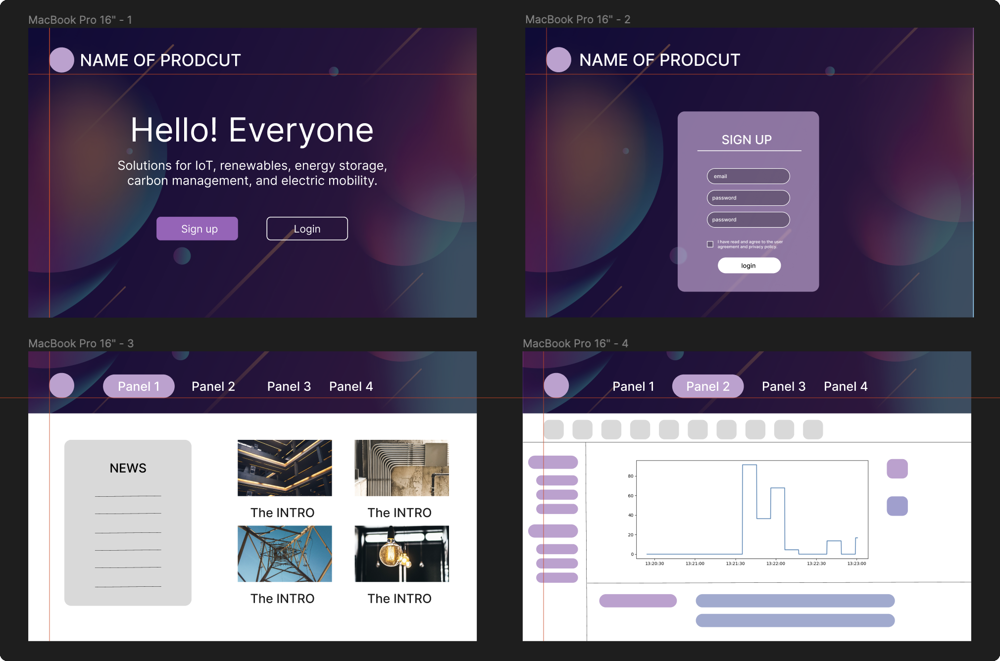
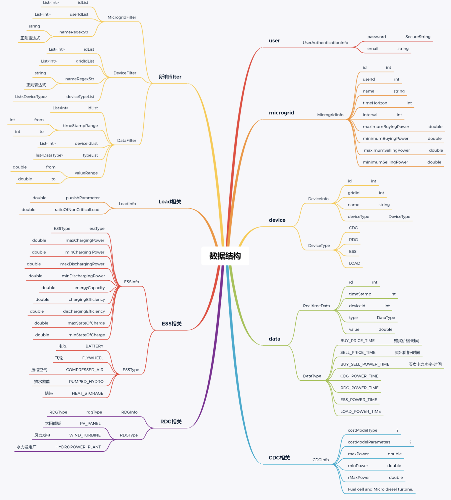

<div align="center">
  
  <h1>MicrogirdEMS</h1>
</div>

<div align="center">
  <p>Energy management of microgrids</p>
</div>

<div align="center">

[](https://docs.microsoft.com/en-us/dotnet/csharp/) [](https://dotnet.microsoft.com/download/dotnet/6.0) [](https://dotnet.microsoft.com/apps/aspnet/web-apps/blazor) [](https://www.microsoft.com/en-us/sql-server/)

</div>

You can choose either of the two languages to read the `readme` document:

- [Chinese](/README.md)
- [English](./README_en.md)

This project is aimed at developing a web-based GUI software for energy management of microgrids. Frontend development tool `vscode`, backend development tool `IDEA`

- [UI Design](#ui-design)
- [Frontend Related](#frontend-related)
  - [Frontend Interface Design](#frontend-interface-design)
  - [Frontend Preview](#frontend-preview)
  - [Running the Frontend](#running-the-frontend)
- [Backend Related](#backend-related)
  - [Keyword Definitions](#keyword-definitions)
  - [](#)
  - [Backend Function Interface Design](#backend-function-interface-design)
  - [Backend Implementation](#backend-implementation)
- [opcua Data Interaction](#opcua-data-interaction)

## UI Design
Designed UI interface using `figma`, only implemented basic wireframe layout.



## Frontend Related

Using `CSharp` and `Blazor WebAssembly` template to accomplish the frontend logic of the project.

Various component libraries were experimented with during actual frontend coding, such as [bootstrap V5](https://getbootstrap.com/docs/5.3/getting-started/introduction/)
, [MudBlazor](https://mudblazor.com/docs/overview)

### Frontend Interface Design


### Frontend Preview


### Running the Frontend
```bash
dotnet watch run  # support hot reload
# port: 5277
```


## Backend Related
### Keyword Definitions
| No.  | Term      | Definition                                     |
| ---- | --------- | ---------------------------------------------- |
| 1    | MicroGrid | Micro Power Grid                               |
| 2    | CDG       | Controllable Distributed Generator             |
| 3    | RDG       | Uncontrollable Renewable Distributed Generator |
| 4    | ESS       | Energy Storage System                          |
| 5    | SOC       | State of Charge (for ESS)                      |

### 

### Backend Function Interface Design


### Backend Implementation
Backend testing environment set up with `springboot` + `MySQL`,
[Testing Backend Code Repository](https://github.com/bloodmooncode/bwa-backend)

[API JSON Collection](./Docs/bwa-api.postman_collection.json) can be imported into Postman for API interface testing

## opcua Data Interaction

[opcua server data](./Docs/opcua.md) remains unimplemented.